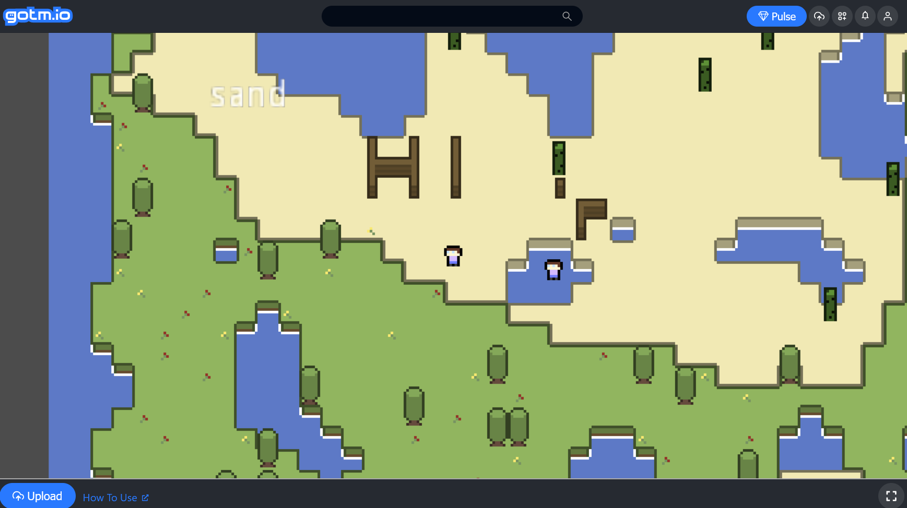
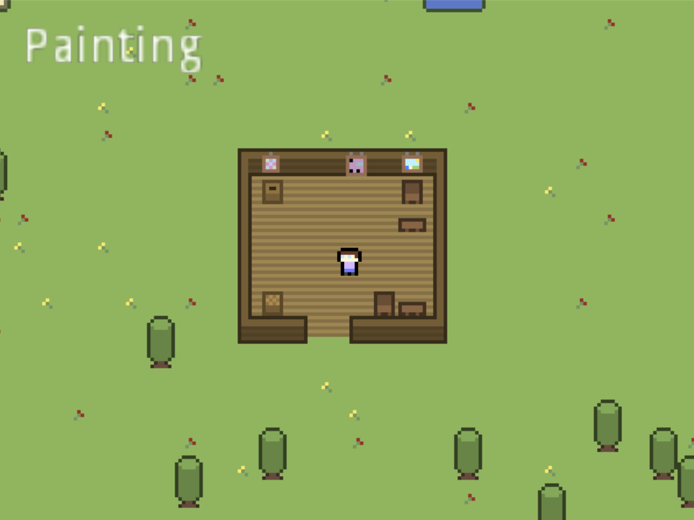
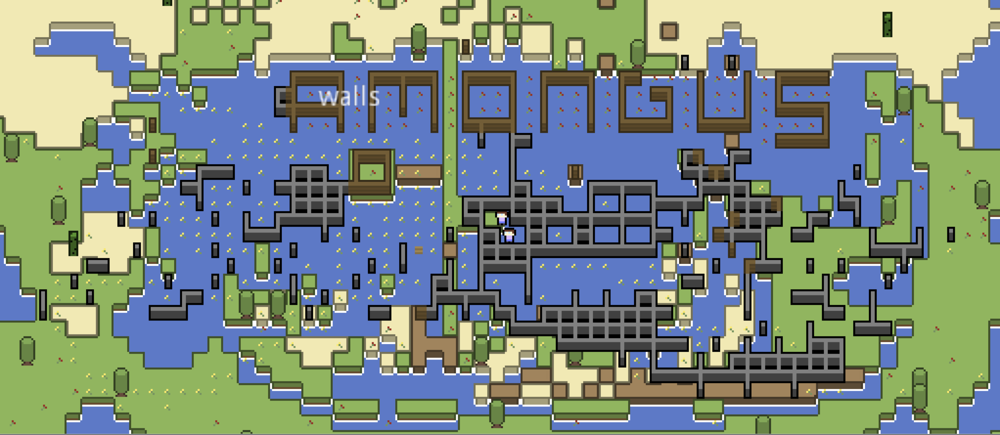

8craft is an experimental, on hold prototype of some kind of tile-based, procedurally generated crafting-survival game. 

### Features
- Randomly Generated Island Worlds
- Placeable/Removable tiles
- Custom autotiling for floor tiles/blocks/walls
- Blocks, Walls, Flooring, Decorations, Furniture tiles
- Working multiplayer

### Previews

